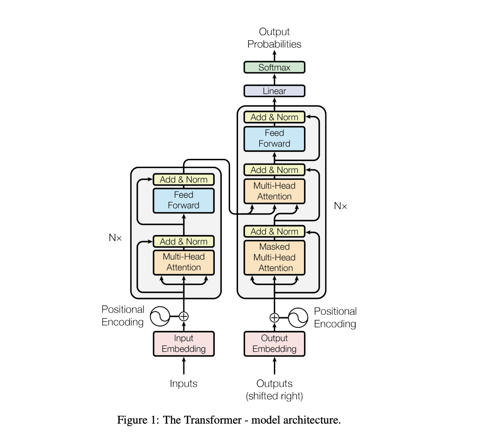
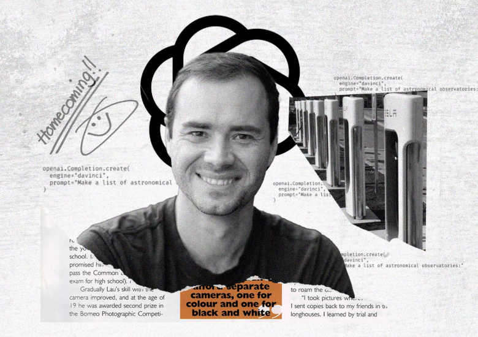
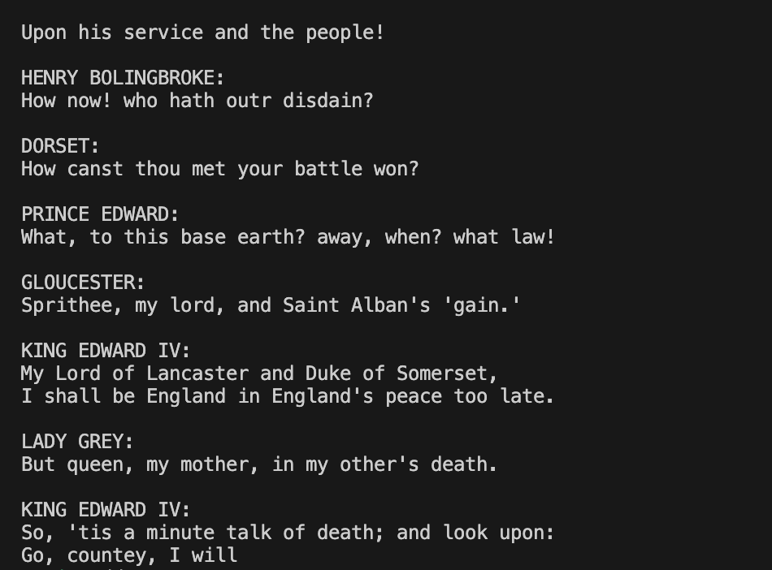
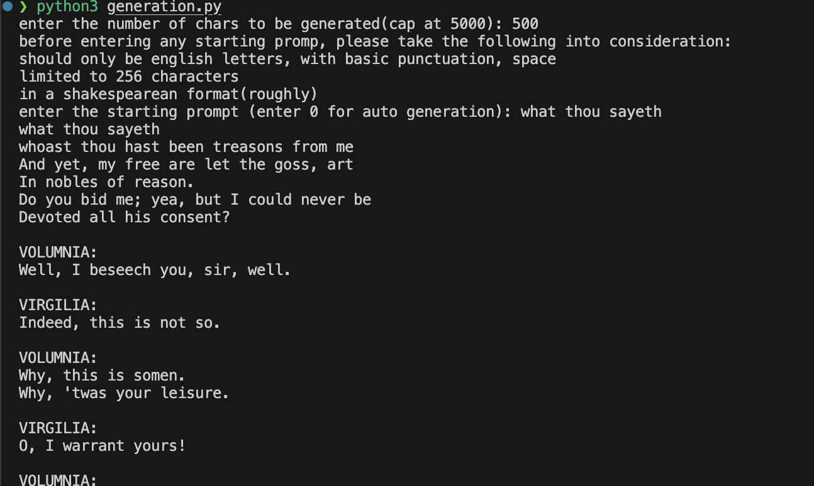

# This is an implementation of a small version of GPT1(with a little under 10M paramters) and GPT2(124M params) along with a web interface to interact with the model

> ## The transformer model architecture
> 

### some other vidoes which helped me understand transformers and the mechanism behind attention:

> ## General overview of transformers
> [](https://www.youtube.com/watch?v=wjZofJX0v4M&list=PLZHQObOWTQDNU6R1_67000Dx_ZCJB-3pi&index=6)

> ## Attention is only 1/3rd of what you need :)
> [](https://www.youtube.com/watch?v=eMlx5fFNoYc&list=PLZHQObOWTQDNU6R1_67000Dx_ZCJB-3pi&index=7)

> ## MLPs within a transformer model
> [](https://www.youtube.com/watch?v=9-Jl0dxWQs8&list=PLZHQObOWTQDNU6R1_67000Dx_ZCJB-3pi&index=8)

### Chris Olah's blogs are also a must read to understand about this and related topics
> ### https://colah.github.io/

### And last but not the least, the zero to hero series by none other than Andrej Karpathy himself
> ### [](https://www.youtube.com/watch?v=VMj-3S1tku0&list=PLAqhIrjkxbuWI23v9cThsA9GvCAUhRvKZ)

 ### I already pretrained the model and saved the models params as a torch state dict, which is present in nanoGPT.pth, here is how u can generate some of your own Shakespearean text 
 ### 
 ```sh
  python3 generation.py
```
 ### enter the inputs, and you have new shakespear :)
 ### The upper cap is 5000 words(for no apparent reason)

### an egs i liked(from first iteration of nanoGPT):


### from a newer one which can take in prompts(starting text)

### pretty good for a "nano" GPT!!

### This was the first iteration, now what I added next was implement a server for this in C, and use js and html to handle the frontend

### once you clone the repo, go to the backend folder within src using 
```sh
cd src/backend
```
### and run the following command
```sh
./server
```

### this runs the server executble and starts the server, then go to
```localhost:8080\main.html```
### then go to nanoGPT or pearGPT to play with it!(the nanoGPT is based on the preloaded weights, and pearGPT is the one I trained on the shakespear dataset)

### within the GPTs, you can copy the text, and it also gives you simultaneous updates on the text generated, just like the actual chatGPT interface.


### all the important things I learnt along the way about actually making the web interface is mentioned in notes.txt
